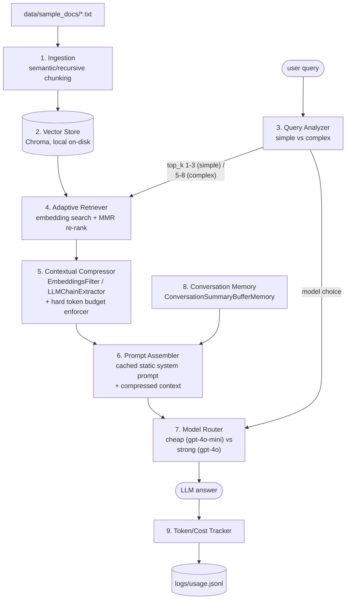

# langchain-adaptive-rag-agent

A token-optimized Retrieval-Augmented Generation (RAG) knowledge/support
assistant built with LangChain. It minimizes token usage and cost at every
stage of the pipeline: dynamic top-k retrieval, MMR re-ranking, contextual
compression with a hard token budget, a cached static system prompt,
complexity-based model routing (cheap vs strong model), and summarizing
conversation memory — with structured JSON-lines logging of tokens, cost, and
latency for every request.

## Architecture

The pipeline has nine stages, each aimed at cutting tokens/cost without
losing answer quality. See **[docs/ARCHITECTURE.md](docs/ARCHITECTURE.md)**
for the full component diagram, a request sequence diagram, module
responsibilities, and the design rationale behind each stage.



## Repository layout

```
langchain-adaptive-rag-agent/
  src/
    ingestion/     # document loaders + semantic/recursive chunker
    retrieval/     # vector store, adaptive retriever, compressor, prompt assembler
    routing/       # complexity classifier + cheap/strong model router
    memory/        # ConversationSummaryBufferMemory wrapper
    tracking/      # JSON-lines token/cost/latency logger
    pipeline.py    # wires all stages together (used by CLI + evals)
    main.py        # CLI entry point
  evals/           # optimized-vs-baseline token/cost benchmark script
  tests/           # unit tests for chunker, retriever, router, compressor, tracker
  data/sample_docs/ # sample documents for quick testing
  docs/            # detailed architecture documentation + diagrams
  requirements.txt / pyproject.toml
  .env.example
```

## Documentation

- **[docs/ARCHITECTURE.md](docs/ARCHITECTURE.md)** — component diagram, a
  full request sequence diagram, the ingestion data flow, a table of module
  responsibilities, the design rationale behind each optimization (why MMR,
  why a heuristic classifier, why a hard token budget after compression,
  etc.), and extension points for swapping the vector store, compressor, or
  document loaders.

## Setup

1. **Create and activate a virtual environment:**

   ```bash
   python -m venv .venv
   # Windows
   .venv\Scripts\activate
   # macOS/Linux
   source .venv/bin/activate
   ```

2. **Install dependencies:**

   ```bash
   pip install -r requirements.txt
   ```

3. **Configure environment variables:**

   ```bash
   cp .env.example .env
   # then edit .env and set OPENAI_API_KEY (and OPENAI_BASE_URL if using an
   # OpenAI-compatible proxy such as Azure OpenAI, LiteLLM, or vLLM)
   ```

### Environment variables

| Variable | Purpose | Default |
|---|---|---|
| `OPENAI_API_KEY` | API key for the OpenAI-compatible endpoint | *(required)* |
| `OPENAI_BASE_URL` | Base URL, for OpenAI-compatible proxies | `https://api.openai.com/v1` |
| `CHEAP_MODEL` | Model for simple/factual queries | `gpt-4o-mini` |
| `STRONG_MODEL` | Model for complex/multi-hop queries | `gpt-4o` |
| `EMBEDDING_MODEL` | Embedding model for indexing/retrieval | `text-embedding-3-small` |
| `CHROMA_PERSIST_DIR` | Local Chroma persistence directory | `./chroma_db` |
| `CHROMA_COLLECTION_NAME` | Chroma collection name | `adaptive_rag_docs` |
| `SIMPLE_TOP_K_MIN` / `SIMPLE_TOP_K_MAX` | Top-k range for simple queries | `1` / `3` |
| `COMPLEX_TOP_K_MIN` / `COMPLEX_TOP_K_MAX` | Top-k range for complex queries | `5` / `8` |
| `MMR_FETCH_K_MULTIPLIER` | Candidate pool multiplier before MMR narrows to top-k | `4` |
| `MMR_LAMBDA` | MMR diversity/relevance trade-off (0-1) | `0.5` |
| `CONTEXT_TOKEN_BUDGET` | Hard cap on assembled context tokens | `1500` |
| `MEMORY_MAX_TOKEN_LIMIT` | Token threshold before memory summarizes older turns | `800` |
| `CHUNK_SIZE` / `CHUNK_OVERLAP` | Recursive splitter chunk size/overlap | `800` / `100` |
| `USE_SEMANTIC_CHUNKER` | Use `SemanticChunker` instead of recursive splitting | `false` |
| `TRACKING_LOG_PATH` | JSON-lines usage log path | `./logs/usage.jsonl` |
| `CHEAP_MODEL_PROMPT_PRICE_PER_1K` / `CHEAP_MODEL_COMPLETION_PRICE_PER_1K` | Cheap model pricing (USD/1K tokens) | `0.00015` / `0.0006` |
| `STRONG_MODEL_PROMPT_PRICE_PER_1K` / `STRONG_MODEL_COMPLETION_PRICE_PER_1K` | Strong model pricing (USD/1K tokens) | `0.0025` / `0.01` |

## Usage

### Ingest documents

```bash
python -m src.main ingest data/sample_docs
```

This loads `.txt`/`.md` files from the given directory, chunks them
(semantically or recursively), embeds them, and indexes them into the local
Chroma store.

### Ask a question

```bash
python -m src.main query "What payment methods are supported?"
```

The CLI classifies the query's complexity, retrieves an adaptive number of
chunks via MMR, compresses/budgets the context, routes to the appropriate
model, prints the answer, and prints a usage summary (complexity, model,
tokens, estimated cost, latency) to stderr. Every request is also appended as
a JSON line to `logs/usage.jsonl`.

## Running tests

```bash
pytest
```

Tests cover the chunker fallback behavior, the complexity classifier and
model router, the adaptive retriever's dynamic top-k logic, the compressor's
hard token budget enforcement, and the usage tracker — all without requiring
a live API key (a dummy key is injected via `tests/conftest.py`, and network
calls are avoided by testing against fakes/mocks).

## Running the cost/quality benchmark

```bash
python -m evals.benchmark
```

This ingests `data/sample_docs` into a temporary, offline vector store (using
a deterministic hashing-based embedder so **no API key or network access is
required**) and compares the optimized adaptive pipeline against a naive
baseline (fixed `top_k=10`, no MMR, no compression) across a mix of simple
and complex sample queries. It prints a per-query comparison table plus
average token/cost savings, and writes a detailed `evals/report.json`.

To benchmark using real OpenAI embeddings instead, set
`EVAL_USE_REAL_EMBEDDINGS=true` and ensure `OPENAI_API_KEY` is configured.
