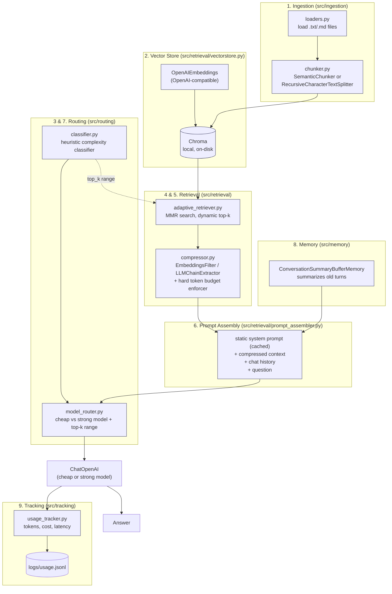
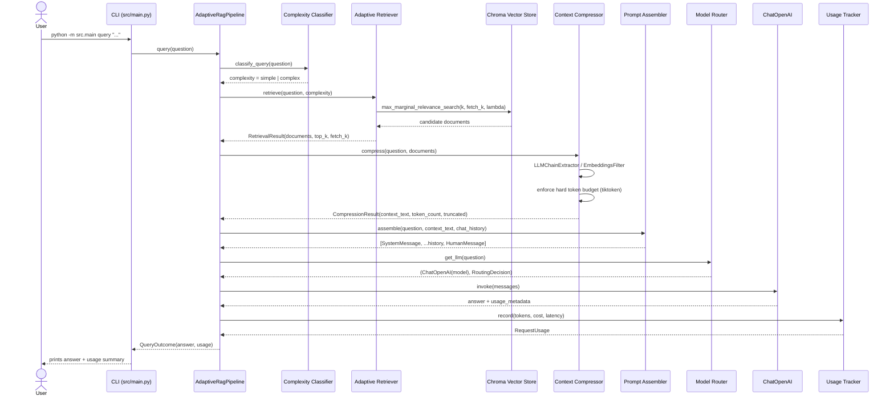
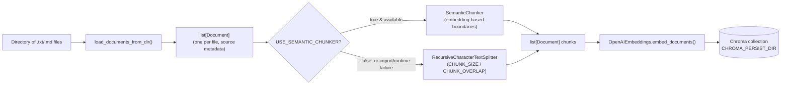

# Architecture

This document describes the internal architecture of `langchain-adaptive-rag-agent`
in more depth than the README: module responsibilities, data flow, request
lifecycle, and the design decisions behind each token-optimization technique.

## Design goals

1. **Minimize tokens sent to the LLM on every request** without sacrificing
   answer quality, by retrieving only as much context as the query actually
   needs and stripping irrelevant content from what is retrieved.
2. **Minimize cost per request** by routing simple/factual queries to a cheap
   model and reserving the strong (expensive) model for genuinely complex,
   multi-hop questions.
3. **Avoid resending redundant data** — full chat history, oversized
   contexts, or repeated system prompts — on every turn.
4. **Run entirely locally** for storage (Chroma, on disk) so the project has
   no external database dependency, while remaining pluggable to any
   OpenAI-compatible LLM/embeddings API.
5. **Make cost/latency visible**, not implicit, via structured per-request
   logging that can be analyzed or fed into dashboards.

## Component diagram

`src/pipeline.py::AdaptiveRagPipeline` is the orchestrator that wires every
box above together; it is the single entry point used by both the CLI
(`src/main.py`) and the eval script (`evals/benchmark.py`).

## Query request sequence

## Ingestion data flow

Semantic chunking always has a safety fallback: any import error or runtime
failure (e.g. no embeddings API reachable) causes the pipeline to silently
fall back to `RecursiveCharacterTextSplitter`, so ingestion never hard-fails
because of the experimental dependency.

## Module responsibilities

| Module | Responsibility |
|---|---|
| `src/config.py` | Single source of truth for all env-var-driven settings (`Settings` dataclass). |
| `src/ingestion/loaders.py` | Reads `.txt`/`.md` files into `Document` objects with source metadata. |
| `src/ingestion/chunker.py` | Splits documents into chunks; semantic chunking with recursive-splitter fallback. |
| `src/retrieval/vectorstore.py` | Builds the embeddings client and the local Chroma collection. |
| `src/routing/classifier.py` | Heuristic (no LLM call) classification of query complexity (simple/complex). |
| `src/routing/model_router.py` | Maps complexity → model name and → top-k range; constructs `ChatOpenAI`. |
| `src/retrieval/adaptive_retriever.py` | MMR search with a `top_k` computed from complexity, and `fetch_k` candidate pool. |
| `src/retrieval/compressor.py` | Runs `EmbeddingsFilter`/`LLMChainExtractor`, then hard-truncates to `CONTEXT_TOKEN_BUDGET` tokens (token-exact via `tiktoken`, never document-count-based). |
| `src/retrieval/prompt_assembler.py` | Combines the static, reused `STATIC_SYSTEM_PROMPT` with history and compressed context. |
| `src/memory/summary_memory.py` | `ConversationSummaryBufferMemory` wrapper; summarizes once `MEMORY_MAX_TOKEN_LIMIT` is exceeded. |
| `src/tracking/usage_tracker.py` | Computes token counts/estimated cost/latency and appends one JSON line per request. |
| `src/pipeline.py` | `AdaptiveRagPipeline` — orchestrates all of the above for `ingest()` and `query()`. |
| `src/main.py` | Thin CLI wrapper (`ingest <dir>`, `query "<question>"`) around the pipeline. |
| `evals/benchmark.py` | Compares the full optimized pipeline against a naive `top_k=10`, no-compression baseline, fully offline. |

## Key design decisions

- **Heuristic complexity classifier instead of an LLM call.** Classifying
  complexity via keyword/length/connector heuristics (`src/routing/classifier.py`)
  costs zero tokens and zero latency, since it must run on *every* query
  before any model is chosen. An LLM-based classifier would add cost to the
  very thing this project is trying to minimize.
- **MMR over plain similarity search.** Maximal Marginal Relevance reduces
  redundancy among retrieved chunks so a small `top_k` (as low as 1-3 for
  simple queries) still covers diverse, non-overlapping information instead
  of near-duplicate chunks.
- **Hard token budget enforced after compression, not before.** The
  compressor (`EmbeddingsFilter`/`LLMChainExtractor`) is given the chance to
  do a "soft" relevance-based reduction first; the token-budget enforcer is a
  deterministic backstop (via `tiktoken`) that guarantees the assembled
  context can never exceed `CONTEXT_TOKEN_BUDGET`, even if the compressor
  underperforms.
- **Static, reused system prompt.** `STATIC_SYSTEM_PROMPT` is a module-level
  constant, never regenerated per-request. Keeping this prefix byte-identical
  across calls maximizes automatic prompt-caching hits on providers that
  support it (e.g. OpenAI), in addition to simply being fewer tokens to
  reason about.
- **`ConversationSummaryBufferMemory` instead of full-history replay.** Once
  the running chat history exceeds `MEMORY_MAX_TOKEN_LIMIT` tokens, older
  turns are summarized by the LLM instead of being resent verbatim on every
  subsequent request.
- **Local Chroma instead of a hosted vector DB.** No external service or
  credentials are required to run the project end-to-end; `CHROMA_PERSIST_DIR`
  is just a folder on disk.
- **OpenAI-compatible client construction.** `ModelRouter` and
  `get_embeddings()` always pass `base_url` from settings, so the same code
  works against OpenAI, Azure OpenAI-compatible gateways, or local proxies
  (LiteLLM, vLLM) without code changes — only `OPENAI_BASE_URL` needs to change.

## Extension points

- **Swap the vector store:** replace `src/retrieval/vectorstore.py` with any
  other LangChain-supported store; `AdaptiveRetriever` only depends on
  `max_marginal_relevance_search(query, k, fetch_k, lambda_mult)`.
- **Swap the compressor:** `ContextCompressor(kind=...)` already supports
  `"embeddings_filter"` (no LLM call) and `"llm_extractor"` (LLM rewrites each
  chunk); additional `DocumentCompressorPipeline` stages can be added in
  `_build_compressor()`.
- **Add more document types:** extend `SUPPORTED_EXTENSIONS` and
  `_iter_supported_files()` in `src/ingestion/loaders.py`, or swap in
  LangChain community loaders for PDF/HTML/etc.
- **Tune routing/retrieval:** every threshold (`SIMPLE_TOP_K_MAX`,
  `CONTEXT_TOKEN_BUDGET`, `MMR_LAMBDA`, model names/pricing, etc.) is an env
  var — see the README's environment variable table — so behavior can be
  tuned without code changes.
