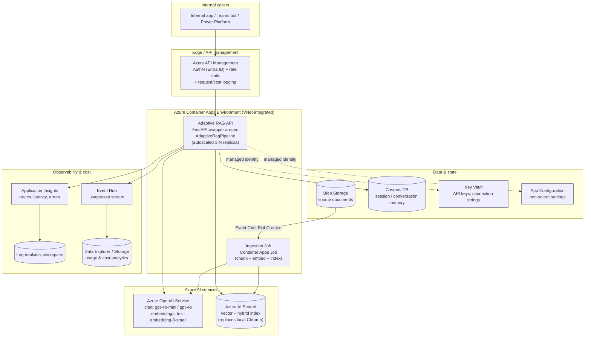
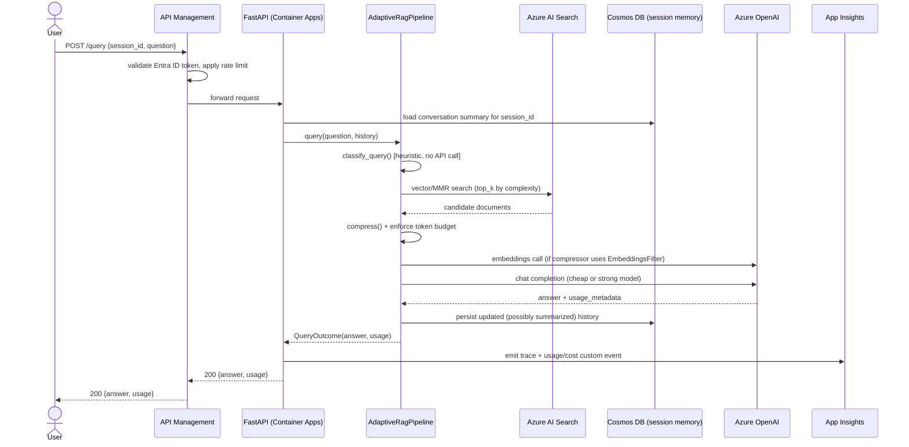
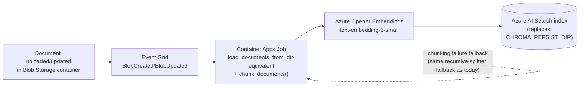
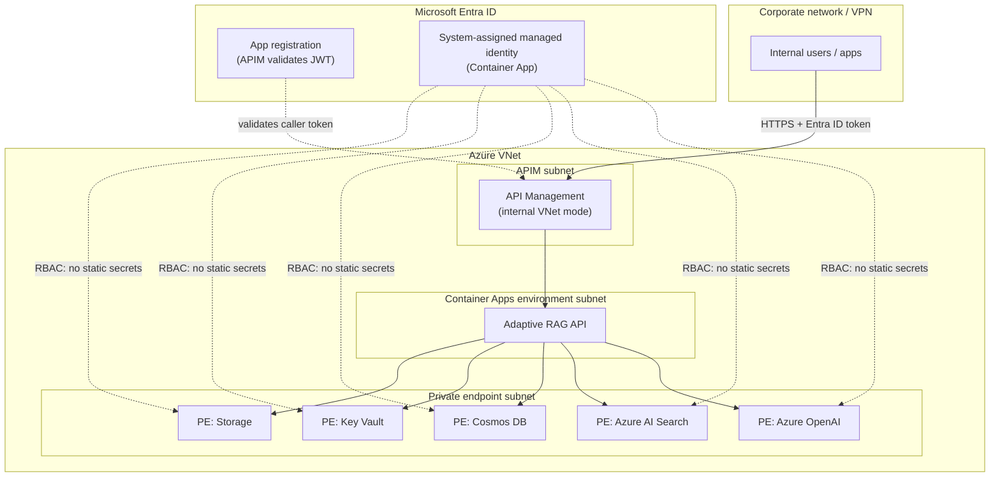

# Azure Cloud Architecture

This document proposes a target Azure architecture for productionizing
`langchain-adaptive-rag-agent` as an **internal API service**. It maps every
existing module (see [ARCHITECTURE.md](ARCHITECTURE.md)) onto managed Azure
services, and calls out exactly what code changes each swap implies.

## Why this needs to change from the current design

The current implementation is intentionally local-first (see
[ARCHITECTURE.md](ARCHITECTURE.md#design-goals)): a CLI process, an on-disk
Chroma collection, an in-process conversation memory object, and a local
`logs/usage.jsonl` file. That is correct for a single-user/dev tool, but three
assumptions break as soon as this runs as a shared internal service behind an
API:

1. **Statelessness of replicas.** An API needs to scale horizontally.
   `Chroma` (on-disk), `ConversationSummaryBufferMemory` (in-process), and the
   JSON-lines log file are all single-process/single-disk state that
   wouldn't be shared or durable across replicas.
2. **Secrets.** `OPENAI_API_KEY` currently lives in a local `.env` file. A
   shared service needs centrally managed, rotatable secrets and
   non-human-credential auth to dependencies.
3. **Governance.** A shared internal tool needs auth on the API itself,
   per-caller quota/rate limiting, and centralized cost/usage visibility —
   not a per-user local log file.

Everything below addresses these three gaps while reusing as much of the
existing pipeline logic (`src/pipeline.py`, `src/routing`, `src/retrieval`)
as possible unchanged.

## High-level architecture

## Component mapping

| Current component | Azure target | Why |
|---|---|---|
| `src/main.py` CLI | **FastAPI** app on **Azure Container Apps**, exposing `POST /query` and `POST /ingest` | Internal API service shape; Container Apps gives HTTP-driven autoscaling (incl. scale-to-zero) without the operational overhead of AKS for a single-service workload |
| `src/retrieval/vectorstore.py` (`Chroma`, on-disk) | **Azure AI Search** (vector + hybrid index), via `langchain-community`'s `AzureSearch` vector store | Managed, durable, scalable, supports the same `similarity_search`/`max_marginal_relevance_search` interface `AdaptiveRetriever` already depends on; also gives semantic ranking and RBAC/private endpoint support |
| Direct `OPENAI_API_KEY` + `OPENAI_BASE_URL` calls | **Azure OpenAI Service**, fronted by **Azure API Management** | `src/config.py` and `src/routing/model_router.py` already parameterize `base_url`/key — only the values change, plus swapping to Entra ID/managed-identity auth instead of a static key. APIM adds org-wide quota, auditing, and centralized model governance |
| `data/sample_docs` local directory + manual `ingest` CLI call | **Blob Storage** (source docs) + **Event Grid** (`BlobCreated`) + **Container Apps Job** running the existing `chunk_documents`/`load_documents_from_dir` logic | Decouples ingestion from the query path and makes re-indexing automatic when documents change, instead of a manual local command |
| `ConversationSummaryBufferMemory` (in-process, per CLI run) | Same LangChain memory class, but the summarized buffer is persisted per session in **Cosmos DB** | Container Apps replicas are stateless and autoscaled; conversation state must survive across replicas/restarts and be retrievable by session ID |
| `logs/usage.jsonl` local file (`src/tracking/usage_tracker.py`) | Structured logs to **Application Insights** (traces/latency/errors) + usage records streamed to **Event Hub** → **Data Explorer**/Storage for cost dashboards | A shared service can't rely on one process's local disk; App Insights gives distributed tracing across replicas, and the Event Hub path preserves the existing "one record per request" model for offline cost analysis (Power BI, ADX) |
| `.env` file (`OPENAI_API_KEY`, etc.) | **Key Vault** (secrets) + **Azure App Configuration** (non-secret tunables) + Container App **managed identity** | No secret material in code, config files, or container images; `Settings` (`src/config.py`) loads from App Configuration/Key Vault references at startup instead of `os.getenv` |

Everything **not** in this table — `classifier.py`'s heuristic complexity
classification, `model_router.py`'s cheap/strong decision logic,
`compressor.py`'s compression + hard token budget, `prompt_assembler.py`'s
static system prompt, and `pipeline.py`'s orchestration — stays as-is. The
whole point of the existing design (OpenAI-compatible client construction,
settings-driven thresholds) is that it was already built to be portable to a
managed endpoint.

## Query request flow (target state)

## Ingestion flow (target state)

The chunking logic (`src/ingestion/chunker.py`, including its
semantic-chunker-with-fallback behavior) is reused verbatim inside the job;
only the sink at the end changes from `vectorstore.add_documents()` against
local Chroma to the same call against an `AzureSearch` vector store instance.

## Identity, networking & security

Key points:

- **No static API keys in the app.** The Container App's system-assigned
  managed identity is granted RBAC roles (`Cognitive Services OpenAI User`,
  `Search Index Data Contributor`, Cosmos DB data-plane role, `Key Vault
  Secrets User`) instead of `src/config.py` reading a key from `.env`.
- **All PaaS dependencies are reached via private endpoints**, so traffic
  between the API, Azure OpenAI, AI Search, Cosmos DB, Key Vault, and Storage
  never traverses the public internet.
- **APIM in internal/VNet mode** is the only entry point, enforcing Entra ID
  auth and per-caller/team rate limits before a request ever reaches the
  container.
- **Azure OpenAI content filtering** stays enabled by default; for an
  internal support/knowledge assistant this is generally desirable and
  requires no code change.

## Code-level migration notes

- **`src/config.py`**: keep the `Settings` dataclass shape; change the
  `field(default_factory=...)` sources to read from Azure App Configuration
  (non-secret values) and Key Vault references (secrets), typically via the
  `azure-appconfiguration-provider` SDK at startup, instead of `os.getenv`
  directly. `OPENAI_BASE_URL` becomes the Azure OpenAI or APIM endpoint.
- **`src/retrieval/vectorstore.py`**: replace `Chroma(...)` construction with
  `AzureSearch(...)` from `langchain-community`; `AdaptiveRetriever` in
  `src/retrieval/adaptive_retriever.py` needs no change as long as the
  replacement store supports `max_marginal_relevance_search` (it does).
- **`src/memory/summary_memory.py`**: wrap the existing
  `ConversationSummaryBufferMemory` with a load/save hook keyed by
  `session_id` against Cosmos DB, so the same summarization logic runs, but
  state is fetched/persisted per request instead of held in a long-lived
  process object.
- **`src/tracking/usage_tracker.py`**: keep `RequestUsage`/`estimate_cost`
  as-is; change `log()` to emit an Application Insights custom event (via
  `opencensus-ext-azure` or the `azure-monitor-opentelemetry` distro) and,
  optionally, publish the same record to Event Hub for downstream cost
  analytics — instead of appending to a local file.
- **`src/main.py`**: add a thin FastAPI app (new file, e.g.
  `src/api.py`) that calls the same `AdaptiveRagPipeline.query()`/`.ingest()`
  methods; the CLI can remain for local dev/debugging against the same
  pipeline class.
- **Unchanged**: `src/routing/classifier.py`, `src/routing/model_router.py`
  (only model/endpoint names change), `src/retrieval/compressor.py`,
  `src/retrieval/prompt_assembler.py`, `src/ingestion/chunker.py`,
  `src/ingestion/loaders.py`, `src/pipeline.py`'s orchestration logic.

## Observability & cost governance

- **Application Insights** captures per-request traces (classification →
  retrieval → compression → LLM call → response), matching the existing
  sequence diagram, so latency regressions are attributable to a specific
  stage.
- **APIM policies** enforce per-team/per-app quotas so no single internal
  caller can dominate Azure OpenAI throughput or budget.
- **Cost dashboard**: the `RequestUsage` record (query, model, complexity,
  tokens, estimated cost, latency) already produced by
  `UsageTracker.record()` is streamed to Event Hub → Data Explorer/Storage,
  preserving the exact schema used by `evals/benchmark.py` today, so the same
  optimized-vs-baseline analysis can be run against production traffic.
- **Azure Monitor alerts** on: elevated strong-model routing rate (signals
  classifier drift), token-budget truncation rate, and daily cost thresholds.

## CI/CD & environments

- **Azure Container Registry** stores the built image; **GitHub
  Actions**/Azure DevOps pipeline runs `pytest` (existing test suite) and
  `evals/benchmark.py` (offline, no API key needed) as a merge gate, then
  builds/pushes the image and deploys a new Container Apps revision.
  Multi-revision traffic splitting lets a new revision take a small
  percentage of traffic before a full cutover.
- **Environments**: separate Azure OpenAI deployments and AI Search
  indexes/services for dev/test/prod, selected via App Configuration labels
  per environment — no code changes needed, matching the existing
  environment-variable-driven design.

## Non-functional considerations

- **Scaling**: Container Apps scales on concurrent HTTP requests; Azure
  OpenAI can move from pay-as-you-go to Provisioned Throughput Units (PTU) if
  internal usage volume needs guaranteed latency/capacity.
- **HA/DR**: Azure AI Search and Cosmos DB support zone/region redundancy;
  for a single-region internal tool, zone-redundant SKUs are sufficient
  starting point, with cross-region read replicas as a later phase if needed.
- **Data residency**: since this is internal-only, a single region matching
  the org's primary Azure region is sufficient; no multi-region routing is
  proposed initially.

## Suggested phased rollout

1. **Phase 1** — Stand up Azure OpenAI + Azure AI Search, swap
   `vectorstore.py` to `AzureSearch`, keep everything else (including CLI)
   running against these managed services instead of local Chroma/direct
   OpenAI.
2. **Phase 2** — Wrap `AdaptiveRagPipeline` in FastAPI, deploy to Container
   Apps behind APIM with managed identity + Key Vault; move ingestion to the
   Blob/Event Grid/Job pipeline.
3. **Phase 3** — Move conversation memory to Cosmos DB, usage tracking to
   Application Insights/Event Hub, and wire up cost dashboards/alerts.
